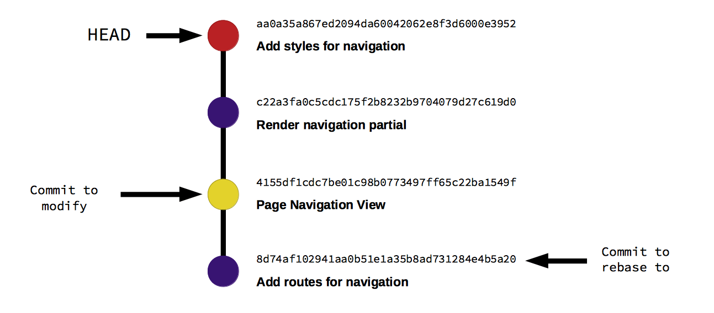

# Some GraphQL studies and other git related stuff

## Git commits
Git commits are the best friends of developers, either they are working with others or not.
Git commits must follow a pattern and must be "atomic".

Some rules of thumb:
- Separate subject from body with a blank line
- Limit the subject line to 50 characters
- Capitalize the subject line
- Do not end the subject line with a period
- Use the imperative mood in the subject line (clean your room, close the door, take out the trash)
    ```txt
    if applied, this commit will ________
    Examples:
    if applied, this commit will clean your room
    if applied, this commit will close the door
    if applied, this commit will take out the trash
    ```
    Obs 👉🏻: Remember: Use of the imperative is important only in the subject line. You can relax this restriction when you’re writing the body.
- Wrap the body at 72 characters
- Use the body to explain what and why vs. how

## How to git rebase
First, verify your `git logs`:
```bash
git log --all --decorate --oneline --graph 
```

Then, you need to select the commit ID right before the commit you want to change.

<caption>In the image above, we want to change the commit "Page Navigation View", then we need to rebase to the commit "Add routes for navigation" which is the commit right before.</caption>

After that, do:
```bash
git rebase -i <commit-id>
```
This will launch your default editor (vi/vim/nano) and you'll be presented with some options that look like the ones below:
```bash
pick 4155df1cdc7 Page Navigation View
pick c22a3fa0c5c Render navigation partial
pick aa0a35a867e Add styles for navigation

# Rebase 8d74af10294..aa0a35a867e onto 8d74af10294 (3 commands)
#
# Commands:
# p, pick = use commit
# r, reword = use commit, but edit the commit message
# e, edit = use commit, but stop for amending
# s, squash = use commit, but meld into previous commit
# f, fixup = like "squash", but discard this commit's log message
# x, exec = run command (the rest of the line) using shell
# d, drop = remove Git commit
#
# These lines can be re-ordered; they are executed from top to bottom.
#
# If you remove a line here THAT COMMIT WILL BE LOST.
#
# However, if you remove everything, the rebase will be aborted.
#
# Note that empty commits are commented out
```
Change from "pick" to "edit" for the commit you want to change. In our case, it'd be:
```bash
pick 4155df1cdc7 Page Navigation View  -> edit 4155df1cdc7 Page Navigation View
```

<quote>Tip 💡: In `vi` you can edit a file by pressing `i`. When you've edited what you wanted, press `ESC`. To quit and save the file, `wq`.</quote>

After that,
```bash
git add .
git rebase --continue
```

It'll ask for some merge changes. Select the ones you want to maintain (fix merge issues) and then keep doing `git rebase --continue` until you find yourself at the HEAD.
When you're there:
```bash
git push --force-with-lease
```